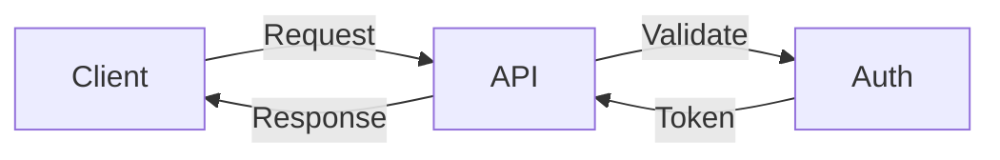

# Documentation Style Guide

## Overview

This guide outlines documentation standards for maintainability, consistency, and clarity. It aims to create documentation that serves as both an effective learning resource and technical reference.

## Core Principles

### 1. **Clarity First**
Write for your target audience. Assume technical competence but not domain expertise.

### 2. **Show, Don't Just Tell**
Every concept should include a practical example.

### 3. **Progressive Disclosure**
Start simple, add complexity gradually.

### 4. **Consistency**
Use consistent terminology, formatting, and structure throughout.

## Documentation Structure

### File Organization

```
docs/
├── index.md                 # Home page
├── getting-started/         # Onboarding content
│   ├── index.md
│   ├── installation.md
│   ├── authentication.md
│   └── quickstart.md
├── guides/                  # How-to guides
│   ├── index.md
│   ├── examples.md
│   ├── transactions.md
│   └── troubleshooting.md
├── api/                     # API reference
│   ├── index.md
│   ├── transaction-builder.md
│   ├── transactions.md
│   └── ...
├── reference/               # Technical reference
│   ├── index.md
│   ├── data-types.md
│   ├── exceptions.md
│   └── changelog.md
└── development/             # Contributor docs
    ├── index.md
    ├── contributing.md
    └── deployment.md
```

### Page Structure

Each documentation page should follow this structure:

```markdown
# Page Title

Brief introduction paragraph explaining what this page covers and why it matters.

---

## Overview (if needed)

High-level explanation of the topic with key concepts.

## Main Content Sections

### Subsection Title

Content with examples...

## Related Topics

- Link to related page
- Another related topic

## Next Steps

Guide the reader to logical next topics.
```

## Formatting Standards

### Headers

- **H1 (#)**: Page title only (one per page)
- **H2 (##)**: Major sections
- **H3 (###)**: Subsections
- **H4 (####)**: Rarely used, only for deep nesting

### Code Examples

#### Do ✅
```python
# Create a client with error handling
from rezen import RezenClient
from rezen.exceptions import AuthenticationError

try:
    client = RezenClient(api_key="your_api_key")
    teams = client.teams.search_teams(status="ACTIVE")
except AuthenticationError:
    print("Invalid API key")
```

#### Don't ❌
```python
# No context or error handling
client = RezenClient()
teams = client.teams.search_teams()
```

### Inline Code

Use backticks for:
- Method names: `search_teams()`
- Parameter names: `status`
- File names: `config.py`
- Commands: `pip install rezen`

### Emphasis

- **Bold** for important terms on first use
- *Italic* for emphasis within sentences
- ==Highlight== for critical warnings (sparingly)

## Content Guidelines

### API Documentation

Each API method should include:

1. **Brief description** of what it does
2. **Parameters** table with types and descriptions
3. **Returns** section describing the response
4. **Example** showing typical usage
5. **Errors** section listing possible exceptions

#### Do ✅
```markdown
## search_teams

Search for teams with filtering and pagination.

### Parameters

| Parameter | Type | Required | Description |
|-----------|------|----------|-------------|
| `status` | `str` | No | Filter by team status |
| `name` | `str` | No | Search by team name |

### Returns

`List[Team]`: List of matching teams.

### Example

```python
teams = client.teams.search_teams(
    status="ACTIVE",
    name="Realty"
)
```

### Errors

- `ValidationError`: Invalid parameters
- `NetworkError`: Connection failed
```

#### Don't ❌
```markdown
## search_teams

This method searches teams.

Example: `client.teams.search_teams()`
```

### Index Pages

Index pages should use card grids for navigation:

#### Do ✅
```markdown
<div class="grid cards" markdown>

-   📝 **Section Title**

    ---

    Brief description of what this section covers

    [:octicons-arrow-right-24: Go to section](link.md)

-   🔧 **Another Section**

    ---

    Description of this section's content

    [:octicons-arrow-right-24: Go to section](link.md)

</div>
```

#### Don't ❌
```markdown
## Sections

- [Section Title](link.md)
- [Another Section](link.md)
```

### Icons and Emojis

- Use Unicode emojis directly (🏠, 🔌, etc.)
- Keep icon usage consistent across similar content
- Don't overuse - one per section heading is usually enough

### Examples

#### Progressive Complexity

Start with the simplest case:

#### Do ✅
```markdown
### Basic Usage

```python
# Simple team search
teams = client.teams.search_teams()
```

### Filtered Search

```python
# Search with filters
teams = client.teams.search_teams(
    status="ACTIVE",
    page_size=50
)
```

### Advanced Usage

```python
# Complex search with full error handling
from rezen.enums import TeamStatus, SortDirection

try:
    teams = client.teams.search_teams(
        status=TeamStatus.ACTIVE,
        sort_by="created_at",
        sort_direction=SortDirection.DESC,
        page_size=100
    )
except ValidationError as e:
    logger.error(f"Invalid search params: {e}")
```

#### Don't ❌
```markdown
### Example

```python
# Here's everything at once
from rezen import RezenClient
from rezen.enums import TeamStatus, SortDirection
from rezen.exceptions import ValidationError
import logging

logger = logging.getLogger(__name__)

try:
    client = RezenClient(api_key=os.getenv("REZEN_API_KEY"))
    teams = client.teams.search_teams(
        status=TeamStatus.ACTIVE,
        name="Realty",
        sort_by="created_at",
        sort_direction=SortDirection.DESC,
        page=1,
        page_size=100
    )
    for team in teams:
        print(f"{team.name}: {team.status}")
except ValidationError as e:
    logger.error(f"Validation error: {e}")
except Exception as e:
    logger.error(f"Unexpected error: {e}")
```

### Tabbed Content

Use tabs for alternative approaches:

#### Do ✅
```markdown
=== "🚀 Basic Operation"

    ```python
    result = client.simple_operation()
    ```

=== "⚙️ Advanced Configuration"

    ```python
    result = client.complex_operation(
        option1=True,
        option2="value"
    )
    ```
```

#### Don't ❌
```markdown
### Method 1
...

### Method 2
...

### Method 3
...
```

## Writing Style

### Voice and Tone

- **Active voice**: "The client sends requests" not "Requests are sent"
- **Direct**: "Use `search_teams()` to find teams" not "One might use..."
- **Professional but approachable**: Technical accuracy with clarity

### Common Patterns

#### Introducing Features

**Do ✅**
> The transaction builder provides a fluent interface for creating complex transactions. Start with a property, add participants, then build.

**Don't ❌**
> ReZEN's revolutionary transaction builder leverages cutting-edge technology to facilitate the creation of transaction objects.

#### Explaining Errors

**Do ✅**
> When authentication fails, the client raises `AuthenticationError`. This typically means your API key is invalid or expired.

**Don't ❌**
> Errors can occur. AuthenticationError happens sometimes.

## Admonitions

Use admonitions to highlight important information:

### Types and Usage

```markdown
!!! note "Optional title"
    General information that adds context.

!!! tip
    Helpful suggestions for better results.

!!! warning
    Important cautions to prevent issues.

!!! danger
    Critical warnings about destructive operations.

!!! success
    Positive confirmations or success states.

!!! example
    Extended examples (use sparingly, prefer code blocks).

!!! info
    Additional context or background information.
```

### When to Use

- **Note**: Additional context that's helpful but not critical
- **Tip**: Best practices or optimization suggestions
- **Warning**: Common mistakes or important limitations
- **Danger**: Data loss, security issues, or breaking changes
- **Success**: Confirmation of correct setup or configuration
- **Info**: Background information or explanations

## Navigation

### Table of Contents

- Keep ToC depth to 3 levels maximum
- Use descriptive headings that work standalone
- Maintain logical flow from general to specific

### Cross-References

#### Internal Links

**Do ✅**
```markdown
See the [Authentication Guide](../getting-started/authentication.md) for setup instructions.
```

**Don't ❌**
```markdown
See [here](../getting-started/authentication.md) for more info.
```

#### Section Links

**Do ✅**
```markdown
Learn more about [error handling](#error-handling) below.
```

**Don't ❌**
```markdown
See the section below.
```

## Code Documentation

### Docstrings

Follow Google style:

```python
def search_teams(
    self,
    status: Optional[str] = None,
    name: Optional[str] = None
) -> List[Team]:
    """Search for teams with optional filtering.
    
    Args:
        status: Filter by team status (e.g., "ACTIVE", "INACTIVE")
        name: Search by team name (partial match)
        
    Returns:
        List of Team objects matching the criteria
        
    Raises:
        ValidationError: If parameters are invalid
        NetworkError: If the API request fails
        
    Example:
        >>> teams = client.teams.search_teams(status="ACTIVE")
        >>> print(f"Found {len(teams)} active teams")
    """
```

### Type Hints

Always include:

```python
from typing import List, Optional, Dict, Any

def process_data(
    items: List[Dict[str, Any]],
    filter_key: Optional[str] = None
) -> List[Dict[str, Any]]:
    """Process with full type hints."""
    pass
```

## Version Documentation

### Changelog Format

```markdown
## [1.2.0] - 2024-01-15

### Added
- New `search_teams()` method with advanced filtering
- Support for pagination in all search methods

### Changed
- Improved error messages for validation failures
- Updated `Team` model with new fields

### Fixed
- Fixed timeout issues in long-running requests
- Corrected type hints for optional parameters

### Deprecated
- `get_team_by_name()` - use `search_teams(name=...)` instead

### Removed
- Removed support for Python 3.7

### Security
- Updated dependencies to patch CVE-2024-1234
```

## Diagrams and Visuals

### When to Include

- **Architecture diagrams**: For system overview
- **Flow charts**: For complex processes
- **Sequence diagrams**: For API interactions
- **Screenshots**: Only for UI elements

### Mermaid Diagrams



## Common Pitfalls

### Avoid These Issues

1. **Inconsistent terminology**: Pick one term and stick with it
2. **Orphaned pages**: Every page should be linked from somewhere
3. **Outdated examples**: Test all code examples regularly
4. **Missing context**: Don't assume prior knowledge
5. **Walls of text**: Break up content with headers and examples

## Review Checklist

Before publishing documentation:

- [ ] All code examples are tested and working
- [ ] Links are valid and point to correct locations
- [ ] Formatting is consistent with this guide
- [ ] Page has clear purpose and audience
- [ ] Navigation makes sense in context
- [ ] No typos or grammar errors
- [ ] Type hints included in all code examples
- [ ] Proper error handling shown where relevant

## Quick Reference

### Essential Elements

Every page needs:
- Clear title and introduction
- Practical examples
- Links to related content
- Consistent formatting

### Markdown Extensions

We use these MkDocs extensions:
- `admonition` for callout boxes
- `pymdownx.tabbed` for tabbed content
- `pymdownx.superfences` for code blocks
- `pymdownx.emoji` for emoji support
- `tables` for data tables
- `toc` for table of contents

### Front Matter

Optional but useful:

```yaml
---
title: Page Title
description: Brief description for SEO
---
```

## Resources

- [MkDocs Documentation](https://www.mkdocs.org/)
- [Material for MkDocs](https://squidfunk.github.io/mkdocs-material/)
- [Google Developer Documentation Style Guide](https://developers.google.com/style)

---

Remember: Good documentation is a feature. It reduces support burden, improves developer experience, and builds trust in your API.
