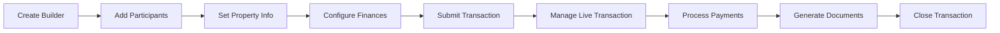

# Transaction Workflows

Complete guide to managing real estate transactions with the ReZEN API, from creation to closing.

---

## 🏗️ Transaction Lifecycle Overview

Real estate transactions in ReZEN follow a structured lifecycle:



---

## 🚀 Complete Transaction Workflow

### Phase 1: Transaction Creation

=== "Basic Transaction Setup"

    ```python
    from rezen import RezenClient
    from rezen.exceptions import RezenError

    def create_basic_transaction():
        """Create a basic transaction with minimal setup."""
        client = RezenClient()

        try:
            # Step 1: Create transaction builder
            response = client.transaction_builder.create_transaction_builder()
            transaction_id = response['id']
            print(f"✅ Created transaction: {transaction_id}")

            # Step 2: Add basic property information
            location_data = {
                "address": "123 Main Street",
                "city": "Anytown",
                "state": "CA",
                "zipCode": "90210"
            }
            client.transaction_builder.update_location_info(
                transaction_id, location_data
            )
            print("✅ Added property location")

            return transaction_id

        except RezenError as e:
            print(f"❌ Transaction creation failed: {e}")
            return None
    ```

=== "Advanced Transaction Setup"

    ```python
    def create_advanced_transaction():
        """Create a transaction with complete configuration."""
        client = RezenClient()

        try:
            # Create transaction builder
            response = client.transaction_builder.create_transaction_builder(
                builder_type="TRANSACTION"
            )
            transaction_id = response['id']

            # Add detailed property information
            location_data = {
                "address": "456 Oak Avenue",
                "city": "Springfield",
                "state": "CA",
                "zipCode": "90210",
                "county": "Los Angeles",
                "subdivision": "Oak Grove Estates",
                "unit": "Unit 2B"
            }
            client.transaction_builder.update_location_info(
                transaction_id, location_data
            )

            # Set pricing and dates
            price_data = {
                "purchase_price": 750000,
                "earnest_money": 15000,
                "down_payment": 150000,
                "loan_amount": 600000,
                "contract_date": "2024-02-01",
                "closing_date": "2024-03-15"
            }
            client.transaction_builder.update_price_and_date_info(
                transaction_id, price_data
            )

            return transaction_id

        except RezenError as e:
            print(f"❌ Advanced transaction setup failed: {e}")
            return None
    ```

### Phase 2: Participant Management

=== "Adding Core Participants"

    ```python
    def add_core_participants(transaction_id: str):
        """Add buyer, seller, and agents to the transaction."""
        client = RezenClient()

        try:
            # Add buyer
            buyer_data = {
                "type": "BUYER",
                "first_name": "John",
                "last_name": "Doe",
                "email": "john.doe@email.com",
                "phone": "+1-555-123-4567"
            }
            client.transaction_builder.add_buyer(transaction_id, buyer_data)
            print("✅ Added buyer")

            # Add seller
            seller_data = {
                "type": "SELLER",
                "first_name": "Jane",
                "last_name": "Smith",
                "email": "jane.smith@email.com",
                "phone": "+1-555-987-6543"
            }
            client.transaction_builder.add_seller(transaction_id, seller_data)
            print("✅ Added seller")

            # Add buyer's agent
            buyer_agent_data = {
                "agent_id": "buyer-agent-uuid",
                "role": "BUYERS_AGENT"
            }
            client.transaction_builder.add_co_agent(transaction_id, buyer_agent_data)
            print("✅ Added buyer's agent")

            return True

        except RezenError as e:
            print(f"❌ Failed to add participants: {e}")
            return False
    ```

=== "Adding Service Providers"

    ```python
    def add_service_providers(transaction_id: str):
        """Add all necessary service providers."""
        client = RezenClient()

        service_providers = [
            {
                "type": "INSPECTOR",
                "first_name": "Mike",
                "last_name": "Inspector",
                "company": "Quality Inspections Inc",
                "phone": "+1-555-INSPECT",
                "email": "mike@qualityinspections.com"
            },
            {
                "type": "LENDER",
                "first_name": "Sarah",
                "last_name": "Banker",
                "company": "First National Bank",
                "phone": "+1-555-LOANS",
                "email": "sarah@firstnational.com"
            },
            {
                "type": "APPRAISER",
                "first_name": "Bob",
                "last_name": "Appraiser",
                "company": "Accurate Appraisals",
                "phone": "+1-555-VALUE",
                "email": "bob@accurateappraisals.com"
            }
        ]

        try:
            for provider in service_providers:
                client.transaction_builder.add_participant(
                    transaction_id, provider
                )
                print(f"✅ Added {provider['type'].lower()}")

            return True

        except RezenError as e:
            print(f"❌ Failed to add service providers: {e}")
            return False
    ```

### Phase 3: Financial Configuration

=== "Commission Management"

    ```python
    def setup_commission_splits(transaction_id: str):
        """Configure commission splits between agents."""
        client = RezenClient()

        try:
            # Set commission payer
            payer_data = {
                "payer_type": "SELLER",
                "commission_rate": 6.0,
                "flat_fee": False
            }
            client.transaction_builder.add_commission_payer(
                transaction_id, payer_data
            )
            print("✅ Set commission payer")

            # Configure commission splits
            commission_splits = [
                {
                    "agent_id": "listing-agent-uuid",
                    "split_percentage": 50.0,
                    "commission_amount": 22500  # 3% of $750k
                },
                {
                    "agent_id": "buyer-agent-uuid",
                    "split_percentage": 50.0,
                    "commission_amount": 22500  # 3% of $750k
                }
            ]

            client.transaction_builder.update_commission_splits(
                transaction_id, commission_splits
            )
            print("✅ Configured commission splits")

            return True

        except RezenError as e:
            print(f"❌ Commission setup failed: {e}")
            return False
    ```

=== "Title Company Setup"

    ```python
    def setup_title_company(transaction_id: str):
        """Add title company information."""
        client = RezenClient()

        try:
            title_data = {
                "title_company": "Premier Title Co",
                "title_contact": "Sarah Johnson",
                "title_phone": "+1-555-789-0123",
                "title_email": "sarah@premiertitle.com",
                "title_address": "789 Title Lane, Title City, TC 54321",
                "policy_number": "PT-2024-001234"
            }

            client.transaction_builder.update_title_info(
                transaction_id, title_data
            )
            print("✅ Added title company information")

            return True

        except RezenError as e:
            print(f"❌ Title setup failed: {e}")
            return False
    ```

### Phase 4: Transaction Submission & Management

=== "Submit Transaction"

    ```python
    def submit_and_manage_transaction(transaction_id: str):
        """Submit transaction and begin management phase."""
        client = RezenClient()

        try:
            # Submit the transaction
            submit_response = client.transaction_builder.submit_transaction(
                transaction_id
            )
            print("✅ Transaction submitted successfully")

            # Get the live transaction ID
            live_transaction_id = submit_response.get('live_transaction_id', transaction_id)

            # Switch to transactions API for ongoing management
            transaction = client.transactions.get_transaction(live_transaction_id)
            print(f"✅ Retrieved live transaction: {transaction['status']}")

            return live_transaction_id

        except RezenError as e:
            print(f"❌ Transaction submission failed: {e}")
            return None
    ```

=== "Transaction Monitoring"

    ```python
    def monitor_transaction_progress(transaction_id: str):
        """Monitor and update transaction progress."""
        client = RezenClient()

        try:
            # Get current transaction status
            transaction = client.transactions.get_transaction(transaction_id)

            print(f"📊 Transaction Status: {transaction['status']}")
            print(f"🏠 Property: {transaction.get('property', {}).get('address', 'N/A')}")
            print(f"💰 Purchase Price: ${transaction.get('purchase_price', 0):,}")

            # Check for pending tasks or issues
            if transaction.get('status') == 'PENDING_INSPECTION':
                print("⏰ Waiting for inspection to be completed")
            elif transaction.get('status') == 'PENDING_APPRAISAL':
                print("⏰ Waiting for appraisal results")
            elif transaction.get('status') == 'PENDING_FINANCING':
                print("⏰ Waiting for loan approval")

            return transaction

        except RezenError as e:
            print(f"❌ Failed to retrieve transaction: {e}")
            return None
    ```

---

## 💰 Payment Processing

### Earnest Money & Deposits

```python
def process_earnest_money(transaction_id: str, amount: float):
    """Process earnest money deposit."""
    client = RezenClient()

    try:
        # Get payment information
        payment_info = client.transactions.get_payment_info(
            transaction_id, "buyer-agent-uuid"
        )

        # Process the earnest money
        # Note: This would typically integrate with actual payment processing
        print(f"💰 Processing earnest money: ${amount:,}")
        print(f"📋 Payment details: {payment_info}")

        return True

    except RezenError as e:
        print(f"❌ Payment processing failed: {e}")
        return False
```

### Money Transfers

```python
def track_money_transfers(transaction_id: str):
    """Track all money transfers for the transaction."""
    client = RezenClient()

    try:
        transfers = client.transactions.get_money_transfers(transaction_id)

        print("💸 Money Transfers:")
        for transfer in transfers:
            print(f"  - ${transfer.get('amount', 0):,} - {transfer.get('status', 'Unknown')}")
            print(f"    Type: {transfer.get('type', 'N/A')}")
            print(f"    Date: {transfer.get('date', 'N/A')}")

        return transfers

    except RezenError as e:
        print(f"❌ Failed to get money transfers: {e}")
        return []
```

---

## 📄 Document Generation

### Transaction Summary

```python
def generate_transaction_summary(transaction_id: str):
    """Generate and save transaction summary PDF."""
    client = RezenClient()

    try:
        # Generate PDF
        pdf_response = client.transactions.get_transaction_summary_pdf(transaction_id)

        # Save to file (example)
        filename = f"transaction_summary_{transaction_id}.pdf"
        with open(filename, 'wb') as f:
            f.write(pdf_response.content)

        print(f"📄 Transaction summary saved as: {filename}")
        return filename

    except RezenError as e:
        print(f"❌ Failed to generate summary: {e}")
        return None
```

---

## 🏁 Complete Workflow Example

```python
def complete_transaction_workflow():
    """Execute a complete transaction workflow from start to finish."""

    print("🚀 Starting complete transaction workflow...")

    # Phase 1: Create transaction
    transaction_id = create_advanced_transaction()
    if not transaction_id:
        return False

    # Phase 2: Add participants
    if not add_core_participants(transaction_id):
        return False

    if not add_service_providers(transaction_id):
        return False

    # Phase 3: Configure finances
    if not setup_commission_splits(transaction_id):
        return False

    if not setup_title_company(transaction_id):
        return False

    # Phase 4: Submit and manage
    live_transaction_id = submit_and_manage_transaction(transaction_id)
    if not live_transaction_id:
        return False

    # Phase 5: Monitor progress
    transaction = monitor_transaction_progress(live_transaction_id)
    if not transaction:
        return False

    # Phase 6: Process payments
    process_earnest_money(live_transaction_id, 15000)

    # Phase 7: Generate documents
    generate_transaction_summary(live_transaction_id)

    print("🎉 Transaction workflow completed successfully!")
    return True

# Run the complete workflow
if __name__ == "__main__":
    complete_transaction_workflow()
```

---

## 🛠️ Best Practices

### Error Handling

!!! tip "Robust Error Handling"

    ```python
    from rezen.exceptions import ValidationError, NotFoundError

    def safe_transaction_operation(transaction_id: str):
        try:
            # Transaction operation
            result = client.transactions.get_transaction(transaction_id)
            return {"success": True, "data": result}

        except ValidationError as e:
            return {
                "success": False,
                "error": "Invalid data",
                "details": e.invalid_fields
            }
        except NotFoundError:
            return {
                "success": False,
                "error": "Transaction not found"
            }
        except RezenError as e:
            return {
                "success": False,
                "error": str(e)
            }
    ```

### Data Validation

!!! warning "Always Validate Input"

    ```python
    def validate_transaction_data(data: dict) -> bool:
        """Validate transaction data before submission."""
        required_fields = ['address', 'city', 'state', 'zipCode']

        for field in required_fields:
            if not data.get(field):
                print(f"❌ Missing required field: {field}")
                return False

        if data.get('purchase_price', 0) <= 0:
            print("❌ Purchase price must be greater than 0")
            return False

        return True
    ```

### Progress Tracking

!!! example "Track Transaction Progress"

    ```python
    def track_transaction_milestones(transaction_id: str):
        """Track key milestones in the transaction."""
        milestones = {
            'CREATED': '✅ Transaction created',
            'PARTICIPANTS_ADDED': '✅ All participants added',
            'UNDER_CONTRACT': '✅ Under contract',
            'INSPECTION_COMPLETE': '✅ Inspection completed',
            'APPRAISAL_COMPLETE': '✅ Appraisal completed',
            'FINANCING_APPROVED': '✅ Financing approved',
            'CLOSING_SCHEDULED': '✅ Closing scheduled',
            'CLOSED': '🎉 Transaction closed'
        }

        transaction = client.transactions.get_transaction(transaction_id)
        current_status = transaction.get('status')

        print(f"Current Status: {milestones.get(current_status, current_status)}")
    ```

---

## 🔗 Related Documentation

- **[Transaction Builder API](../api/transaction-builder.md)** - Detailed API reference
- **[Transactions API](../api/transactions.md)** - Live transaction management
- **[Error Handling](../reference/exceptions.md)** - Comprehensive error handling
- **[Examples](examples.md)** - More code examples and tutorials
