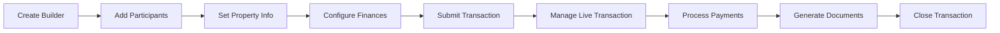

# Transaction Workflows

Complete guide to managing real estate transactions with the ReZEN API, from creation to closing.

---

## 🚨 **CRITICAL REQUIREMENTS** - Read This First!

!!! danger "API Requirements That Must Be Followed"

    Based on extensive testing, these requirements are **MANDATORY** for successful API calls. Failing to follow them will result in "Bad request: Invalid request" errors.

### 🏠 Location Updates

**❌ THIS FAILS:**
```python
# Basic address fields alone will FAIL
location_data = {
    "street": "123 Main St",
    "city": "Salt Lake City", 
    "state": "UTAH",
    "zip": "84101"
}
# API returns: "Bad request: Invalid request"
```

**✅ THIS WORKS:**
```python
# Additional property details are REQUIRED
location_data = {
    "street": "123 Main St",
    "city": "Salt Lake City",
    "state": "UTAH", 
    "zip": "84101",
    "county": "Salt Lake",      # REQUIRED
    "yearBuilt": 2020,         # REQUIRED  
    "mlsNumber": "MLS123456"   # REQUIRED
}
```

### 💰 Price/Date Updates

**❌ THIS FAILS:**
```python
# Basic price fields alone will FAIL
price_data = {
    "dealType": "COMPENSATING",
    "propertyType": "RESIDENTIAL",
    "salePrice": {"amount": 500000, "currency": "USD"},
    "representationType": "BUYER"
}
# API returns: "Bad request: Invalid request"
```

**✅ THIS WORKS:**
```python
# BOTH commission objects are REQUIRED
price_data = {
    "dealType": "COMPENSATING",
    "propertyType": "RESIDENTIAL", 
    "salePrice": {"amount": 500000, "currency": "USD"},
    "representationType": "BUYER",
    "listingCommission": {     # REQUIRED
        "commissionPercent": 3.0,
        "percentEnabled": True,
        "negativeOrEmpty": False
    },
    "saleCommission": {        # REQUIRED
        "commissionPercent": 3.0,
        "percentEnabled": True,
        "negativeOrEmpty": False
    }
}
```

### 👥 Co-Agent Roles

**✅ WORKING ROLES:**
- `"REAL"` - Always works
- `"BUYERS_AGENT"` - Works with location data
- `"SELLERS_AGENT"` - Works with location data

**❌ NON-WORKING ROLES:**
- `"LISTING_AGENT"` - Always fails

### 🏢 Owner Agent Requirements

Owner agents require a **specific sequence** and additional fields:

1. Create transaction
2. Add location info (with additional fields) - **REQUIRED FIRST**
3. Add price/date info (with commission objects) - **REQUIRED SECOND**  
4. Add buyers/sellers - **REQUIRED THIRD**
5. **THEN** add owner agent (with valid `officeId` and `teamId`)

---

## 🏗️ Transaction Lifecycle Overview

Real estate transactions in ReZEN follow a structured lifecycle:



---

## 👥 Handling Multiple Teams

Many users belong to multiple teams in ReZEN. This section shows how to handle team selection when creating transactions.

!!! info "Team Selection in ReZEN"

    When adding an owner agent to a transaction, you must specify:
    - **Agent ID**: Your user ID (automatically retrieved)
    - **Office ID**: Your office ID (automatically retrieved) 
    - **Team ID**: Which team to use (requires selection if multiple)

### 🔍 Discovering Available Teams

First, check what teams and offices you have access to:

```python
from rezen import RezenClient

def check_user_teams():
    """Check what teams the current user belongs to."""
    client = RezenClient()
    
    # Get comprehensive team and office information
    teams_info = client.transaction_builder.get_user_teams_and_offices()
    
    print(f"Agent ID: {teams_info['agent_id']}")
    print(f"Office ID: {teams_info['office_id']}")
    print(f"Has multiple teams: {teams_info['has_multiple_teams']}")
    
    if teams_info["has_multiple_teams"]:
        print(f"\n🏢 You belong to {len(teams_info['teams'])} teams:")
        for team in teams_info["teams"]:
            is_default = team["id"] == teams_info["default_team"]["id"]
            marker = " ⭐ (DEFAULT)" if is_default else ""
            print(f"  - {team['name']}")
            print(f"    Role: {team['role']}")
            print(f"    ID: {team['id']}{marker}")
        
        print(f"\n🎯 Smart default team: {teams_info['default_team']['name']}")
        print("   (Prefers LEADER role over ADMIN)")
    else:
        print(f"\n🏢 Single team: {teams_info['default_team']['name']}")
    
    return teams_info

# Example output:
# Agent ID: 12345678-1234-1234-1234-123456789012
# Office ID: 87654321-4321-4321-4321-210987654321
# Has multiple teams: True
# 
# 🏢 You belong to 2 teams:
#   - The Perry Group Standard Team
#     Role: LEADER
#     ID: team-uuid-1 ⭐ (DEFAULT)
#   - The Perry Group Marketing Group  
#     Role: ADMIN
#     ID: team-uuid-2
#
# 🎯 Smart default team: The Perry Group Standard Team
#    (Prefers LEADER role over ADMIN)
```

### 🚀 Three Approaches to Owner Agent Setup

Choose the approach that best fits your needs:

=== "Option 1: Automatic (Recommended)"

    Use the default team with smart selection logic:

    ```python
    def setup_owner_agent_automatic():
        """Use automatic team selection (prefers LEADER role)."""
        client = RezenClient()
        
        # Create and setup transaction
        transaction_id = create_basic_transaction()
        
        # Set current user as owner agent with default team
        result = client.transaction_builder.set_current_user_as_owner_agent(
            transaction_id, 
            role="BUYERS_AGENT"  # or "SELLERS_AGENT"
        )
        
        print("✅ Owner agent set with default team")
        return result
    
    # This method:
    # - Uses smart default logic (LEADER > ADMIN > first team)
    # - Shows warning if you have multiple teams
    # - Handles all ID resolution automatically
    ```

=== "Option 2: Discovery + Selection"

    Check teams first, then choose explicitly:

    ```python
    def setup_owner_agent_with_choice():
        """Check teams and choose which one to use."""
        client = RezenClient()
        
        # Create transaction
        transaction_id = create_basic_transaction()
        
        # Discover available teams
        teams_info = client.transaction_builder.get_user_teams_and_offices()
        
        if teams_info["has_multiple_teams"]:
            print("Available teams:")
            for i, team in enumerate(teams_info["teams"]):
                role = team["role"]
                name = team["name"]
                is_default = team["id"] == teams_info["default_team"]["id"]
                marker = " (DEFAULT)" if is_default else ""
                print(f"  {i+1}. {name} - Role: {role}{marker}")
            
            # For demo, use default team  
            # In real app, you might prompt user for choice
            selected_team_id = teams_info["default_team"]["id"]
            print(f"Using: {teams_info['default_team']['name']}")
        else:
            selected_team_id = teams_info["default_team"]["id"]
            print(f"Using single team: {teams_info['default_team']['name']}")
        
        # Set owner agent with specific team
        result = client.transaction_builder.set_current_user_as_owner_agent_with_team(
            transaction_id,
            role="BUYERS_AGENT",
            team_id=selected_team_id
        )
        
        print("✅ Owner agent set with chosen team")
        return result
    ```

=== "Option 3: Always Explicit"

    Always specify the team ID directly:

    ```python
    def setup_owner_agent_explicit():
        """Always specify team explicitly for full control."""
        client = RezenClient()
        
        # Create transaction
        transaction_id = create_basic_transaction()
        
        # Get available teams
        teams_info = client.transaction_builder.get_user_teams_and_offices()
        
        # Select team by business logic (e.g., always use LEADER team)
        leader_teams = [t for t in teams_info["teams"] if t["role"] == "LEADER"]
        
        if leader_teams:
            selected_team_id = leader_teams[0]["id"]
            print(f"Using LEADER team: {leader_teams[0]['name']}")
        else:
            # Fallback to default
            selected_team_id = teams_info["default_team"]["id"]
            print(f"No LEADER team, using default: {teams_info['default_team']['name']}")
        
        # Set owner agent with explicit team
        result = client.transaction_builder.set_current_user_as_owner_agent_with_team(
            transaction_id,
            role="BUYERS_AGENT", 
            team_id=selected_team_id
        )
        
        print("✅ Owner agent set with explicit team selection")
        return result
    ```

### ✅ Complete Working Example

Here's a full example that handles multiple teams automatically:

```python
def create_transaction_with_owner_agent():
    """Create complete transaction with owner agent handling multiple teams."""
    client = RezenClient()
    
    try:
        # Step 1: Create transaction
        transaction_id = client.transaction_builder.create_transaction_builder()
        print(f"Created transaction: {transaction_id}")
        
        # Step 2: Add location with ALL required fields
        location_data = {
            "street": "123 Demo Leader Lane",
            "city": "Salt Lake City",
            "state": "UTAH",
            "zip": "84101",
            "county": "Salt Lake",        # REQUIRED
            "yearBuilt": 2020,           # REQUIRED
            "mlsNumber": "MLS-456789"    # REQUIRED
        }
        client.transaction_builder.update_location_info(transaction_id, location_data)
        print("✅ Added location")
        
        # Step 3: Add price/date with commission objects
        price_data = {
            "dealType": "COMPENSATING",
            "propertyType": "RESIDENTIAL",
            "salePrice": {"amount": 750000, "currency": "USD"},
            "representationType": "BUYER",
            "listingCommission": {       # REQUIRED
                "commissionPercent": 3.0,
                "percentEnabled": True,
                "negativeOrEmpty": False
            },
            "saleCommission": {          # REQUIRED
                "commissionPercent": 3.0,
                "percentEnabled": True,
                "negativeOrEmpty": False
            }
        }
        client.transaction_builder.update_price_and_date_info(transaction_id, price_data)
        print("✅ Added price/date")
        
        # Step 4: Add buyer
        buyer_data = {
            "firstName": "Demo",
            "lastName": "Buyer",
            "email": "demo.buyer@example.com",
            "phoneNumber": "(555) 123-4567"
        }
        client.transaction_builder.add_buyer(transaction_id, buyer_data)
        print("✅ Added buyer")
        
        # Step 5: Set owner agent (handles multiple teams automatically)
        result = client.transaction_builder.set_current_user_as_owner_agent(
            transaction_id,
            role="BUYERS_AGENT"  # Must match representationType: BUYER -> BUYERS_AGENT
        )
        print("✅ Set owner agent with automatic team handling")
        
        # Optional: Add co-agent
        co_agent_info = {
            "agentId": "bd465129-b224-43e3-b92f-524ea5f53783",
            "role": "REAL",
            "receivesInvoice": False
        }
        client.transaction_builder.add_co_agent(transaction_id, co_agent_info)
        print("✅ Added co-agent")
        
        return transaction_id
        
    except Exception as e:
        print(f"❌ Error: {e}")
        return None

# Usage
transaction_id = create_transaction_with_owner_agent()
if transaction_id:
    print(f"🎉 Successfully created transaction: {transaction_id}")
```

---

## 🚀 Complete Transaction Workflow

### Phase 1: Transaction Creation

=== "Basic Transaction Setup"

    ```python
    from rezen import RezenClient
    from rezen.exceptions import RezenError

    def create_basic_transaction():
        """Create a basic transaction with correct field names."""
        client = RezenClient()

        try:
            # Step 1: Create transaction builder
            response = client.transaction_builder.create_transaction_builder()
            transaction_id = str(response)  # Extract ID as string
            print(f"✅ Created transaction: {transaction_id}")

            # Step 2: Add property information
            # ⚠️ CRITICAL: Basic address fields alone will FAIL!
            # The API requires additional property details for successful location updates
            location_data = {
                "street": "123 Main Street",  # Use 'street' not 'address'
                "city": "Salt Lake City",
                "state": "UTAH",  # Must be ALL CAPS
                "zip": "84101",   # Use 'zip' not 'zipCode'
                "county": "Salt Lake",      # REQUIRED - API fails without this
                "yearBuilt": 2020,         # REQUIRED - API fails without this
                "mlsNumber": "MLS123456"   # REQUIRED - API fails without this
            }
            client.transaction_builder.update_location_info(
                transaction_id, location_data
            )
            print("✅ Added property location (with required additional fields)")

            # Step 3: Add price/date information
            # ⚠️ CRITICAL: Both commission objects are REQUIRED!
            # Basic price fields alone will FAIL with "Bad request: Invalid request"
            price_date_data = {
                "dealType": "COMPENSATING",
                "propertyType": "RESIDENTIAL",
                "salePrice": {  # Must be object with amount/currency
                    "amount": 500000,
                    "currency": "USD"
                },
                "representationType": "BUYER",
                "listingCommission": {     # REQUIRED - cannot be omitted
                    "commissionPercent": 3.0,
                    "percentEnabled": True,
                    "negativeOrEmpty": False
                },
                "saleCommission": {        # REQUIRED - cannot be omitted
                    "commissionPercent": 3.0,
                    "percentEnabled": True,
                    "negativeOrEmpty": False
                }
            }
            client.transaction_builder.update_price_and_date_info(
                transaction_id, price_date_data
            )
            print("✅ Added pricing (with required commission objects)")

            return transaction_id

        except RezenError as e:
            print(f"❌ Transaction creation failed: {e}")
            return None
    ```

=== "Complete Transaction with Co-Agent"

    ```python
    from datetime import datetime, timedelta
    
    def create_complete_transaction_with_coagent():
        """Create a complete transaction with all details including co-agent."""
        client = RezenClient()

        try:
            # Create transaction builder
            response = client.transaction_builder.create_transaction_builder("TRANSACTION")
            transaction_id = str(response)
            print(f"✅ Created transaction: {transaction_id}")

            # Add location (Required field names: street, zip, state in ALL CAPS)
            location_data = {
                "street": "2158 E Wilson Ave",
                "city": "Salt Lake City",
                "state": "UTAH",  # ALL CAPS required
                "zip": "84108",   # 'zip' not 'zipCode'
                "county": "Salt Lake",
                "yearBuilt": 2020,
                "mlsNumber": "MLS123456"
            }
            client.transaction_builder.update_location_info(transaction_id, location_data)
            print("✅ Added property location")

            # Add price/date info
            closing_date = (datetime.now() + timedelta(days=45)).strftime("%Y-%m-%d")
            price_data = {
                "dealType": "COMPENSATING",
                "propertyType": "RESIDENTIAL",
                "salePrice": {  # Must be object with amount/currency
                    "amount": 565000,
                    "currency": "USD"
                },
                "listingCommission": {
                    "commissionPercent": 3.0,
                    "percentEnabled": True,
                    "negativeOrEmpty": False
                },
                "saleCommission": {
                    "commissionPercent": 3.0,
                    "percentEnabled": True,
                    "negativeOrEmpty": False
                },
                "acceptanceDate": datetime.now().strftime("%Y-%m-%d"),
                "closingDate": closing_date,
                "earnestMoney": 15000,
                "downPayment": 113000,
                "loanAmount": 452000,
                "representationType": "BUYER"
            }
            client.transaction_builder.update_price_and_date_info(transaction_id, price_data)
            print("✅ Added pricing and dates")

            # Add buyer (use camelCase for names)
            buyer_data = {
                "firstName": "John",  # camelCase required
                "lastName": "Doe",
                "email": "john.doe@example.com",
                "phoneNumber": "(801) 555-1234"  # camelCase required
            }
            client.transaction_builder.add_buyer(transaction_id, buyer_data)
            print("✅ Added buyer")

            # Add seller
            seller_data = {
                "firstName": "Jane",
                "lastName": "Smith",
                "email": "jane.smith@example.com",
                "phoneNumber": "(801) 555-5678"
            }
            client.transaction_builder.add_seller(transaction_id, seller_data)
            print("✅ Added seller")

            # Add co-agent (can be added at any time)
            co_agent_info = {
                "agentId": "bd465129-b224-43e3-b92f-524ea5f53783",
                "role": "REAL",
                "receivesInvoice": False,
                "opCityReferral": False,
                "optedInForEcp": False
            }
            client.transaction_builder.add_co_agent(transaction_id, co_agent_info)
            print("✅ Added co-agent")

            # Add title company
            title_info = {
                "company": "Premier Title Company",
                "firstName": "Sarah",
                "lastName": "Johnson",
                "email": "sarah@premiertitle.com",
                "phoneNumber": "(801) 555-9999"
            }
            client.transaction_builder.update_title_info(transaction_id, title_info)
            print("✅ Added title company")

            # Add mortgage info
            mortgage_info = {
                "lenderName": "First National Bank",
                "lenderContact": "Mike Banker",
                "lenderPhone": "(801) 555-2468",
                "lenderEmail": "mike@firstnational.com"
            }
            client.transaction_builder.update_mortgage_info(transaction_id, mortgage_info)
            print("✅ Added mortgage information")

            return transaction_id

        except RezenError as e:
            print(f"❌ Transaction creation failed: {e}")
            print(f"   Error type: {type(e).__name__}")
            return None
    ```

=== "Advanced Transaction Setup"

    ```python
    def create_advanced_transaction():
        """Create a transaction with complete configuration."""
        client = RezenClient()

        try:
            # Create transaction builder
            response = client.transaction_builder.create_transaction_builder(
                builder_type="TRANSACTION"
            )
            transaction_id = str(response)  # Extract ID as string

            # Add detailed property information
            location_data = {
                "street": "456 Oak Avenue",  # Use 'street' not 'address'
                "city": "Springfield",
                "state": "CALIFORNIA",  # ALL CAPS
                "zip": "90210",  # Use 'zip' not 'zipCode'
                "county": "Los Angeles",
                "subdivision": "Oak Grove Estates",
                "unit": "Unit 2B"
            }
            client.transaction_builder.update_location_info(
                transaction_id, location_data
            )

            # Set pricing and dates
            price_data = {
                "dealType": "COMPENSATING",
                "propertyType": "RESIDENTIAL",
                "salePrice": {  # Must be object
                    "amount": 750000,
                    "currency": "USD"
                },
                "earnestMoney": 15000,  # Use camelCase
                "downPayment": 150000,
                "loanAmount": 600000,
                "acceptanceDate": "2024-02-01",  # Use camelCase
                "closingDate": "2024-03-15"
            }
            client.transaction_builder.update_price_and_date_info(
                transaction_id, price_data
            )

            return transaction_id

        except RezenError as e:
            print(f"❌ Advanced transaction setup failed: {e}")
            return None
    ```

### Phase 2: Participant Management

=== "Adding Core Participants"

    ```python
    def add_core_participants(transaction_id: str):
        """Add buyer, seller, and agents to the transaction."""
        client = RezenClient()

        try:
            # Add buyer (use camelCase for field names)
            buyer_data = {
                "firstName": "John",      # Use camelCase
                "lastName": "Doe",        # Use camelCase  
                "email": "john.doe@email.com",
                "phoneNumber": "(555) 123-4567"  # Use camelCase
            }
            client.transaction_builder.add_buyer(transaction_id, buyer_data)
            print("✅ Added buyer")

            # Add seller
            seller_data = {
                "firstName": "Jane",
                "lastName": "Smith",
                "email": "jane.smith@email.com",
                "phoneNumber": "(555) 987-6543"
            }
            client.transaction_builder.add_seller(transaction_id, seller_data)
            print("✅ Added seller")

            # Add co-agent (can be added at any time)
            co_agent_data = {
                "agentId": "bd465129-b224-43e3-b92f-524ea5f53783",
                "role": "REAL",  # Will appear as BUYERS_AGENT/SELLERS_AGENT based on representationType
                "receivesInvoice": False
            }
            client.transaction_builder.add_co_agent(transaction_id, co_agent_data)
            print("✅ Added co-agent")

            return True

        except RezenError as e:
            print(f"❌ Failed to add participants: {e}")
            return False
    ```

=== "Adding Service Providers"

    ```python
    def add_service_providers(transaction_id: str):
        """Add all necessary service providers."""
        client = RezenClient()

        service_providers = [
            {
                "type": "INSPECTOR",
                "firstName": "Mike",      # Use camelCase
                "lastName": "Inspector",  # Use camelCase
                "company": "Quality Inspections Inc",
                "phoneNumber": "(555) INSPECT",  # Use camelCase
                "email": "mike@qualityinspections.com"
            },
            {
                "type": "LENDER",
                "firstName": "Sarah",
                "lastName": "Banker",
                "company": "First National Bank",
                "phoneNumber": "(555) 555-LOAN",
                "email": "sarah@firstnational.com"
            },
            {
                "type": "APPRAISER", 
                "firstName": "Bob",
                "lastName": "Appraiser",
                "company": "Accurate Appraisals",
                "phoneNumber": "(555) 555-VALU",
                "email": "bob@accurateappraisals.com"
            }
        ]

        try:
            for provider in service_providers:
                client.transaction_builder.add_participant(
                    transaction_id, provider
                )
                print(f"✅ Added {provider['type'].lower()}")

            return True

        except RezenError as e:
            print(f"❌ Failed to add service providers: {e}")
            return False
    ```

### Phase 3: Financial Configuration

=== "Commission Management"

    ```python
    def setup_commission_splits(transaction_id: str):
        """Configure commission splits between agents."""
        client = RezenClient()

        try:
            # Set commission payer
            # NOTE: All fields below are REQUIRED
            payer_data = {
                "role": "REAL",  # Valid roles: TITLE, SELLER, LANDLORD, OTHER_AGENT, REAL
                "firstName": "Commission",
                "lastName": "Payer",
                "email": "commission@example.com", 
                "phoneNumber": "(555) 111-2222",
                "companyName": "Commission Company LLC",
                "receivesInvoice": True,
                "opCityReferral": False,
                "optedInForEcp": False
            }
            client.transaction_builder.add_commission_payer(
                transaction_id, payer_data
            )
            print("✅ Set commission payer")

            # Configure commission splits
            commission_splits = [
                {
                    "agent_id": "listing-agent-uuid",
                    "split_percentage": 50.0,
                    "commission_amount": 22500  # 3% of $750k
                },
                {
                    "agent_id": "buyer-agent-uuid",
                    "split_percentage": 50.0,
                    "commission_amount": 22500  # 3% of $750k
                }
            ]

            client.transaction_builder.update_commission_splits(
                transaction_id, commission_splits
            )
            print("✅ Configured commission splits")

            return True

        except RezenError as e:
            print(f"❌ Commission setup failed: {e}")
            return False
    ```

=== "Title Company Setup"

    ```python
    def setup_title_company(transaction_id: str):
        """Add title company information."""
        client = RezenClient()

        try:
            title_data = {
                "title_company": "Premier Title Co",
                "title_contact": "Sarah Johnson",
                "title_phone": "+1-555-789-0123",
                "title_email": "sarah@premiertitle.com",
                "title_address": "789 Title Lane, Title City, TC 54321",
                "policy_number": "PT-2024-001234"
            }

            client.transaction_builder.update_title_info(
                transaction_id, title_data
            )
            print("✅ Added title company information")

            return True

        except RezenError as e:
            print(f"❌ Title setup failed: {e}")
            return False
    ```

### Phase 4: Transaction Submission & Management

=== "Submit Transaction"

    ```python
    def submit_and_manage_transaction(transaction_id: str):
        """Submit transaction and begin management phase."""
        client = RezenClient()

        try:
            # Submit the transaction
            submit_response = client.transaction_builder.submit_transaction(
                transaction_id
            )
            print("✅ Transaction submitted successfully")

            # Get the live transaction ID
            live_transaction_id = submit_response.get('live_transaction_id', transaction_id)

            # Switch to transactions API for ongoing management
            transaction = client.transactions.get_transaction(live_transaction_id)
            print(f"✅ Retrieved live transaction: {transaction['status']}")

            return live_transaction_id

        except RezenError as e:
            print(f"❌ Transaction submission failed: {e}")
            return None
    ```

=== "Transaction Monitoring"

    ```python
    def monitor_transaction_progress(transaction_id: str):
        """Monitor and update transaction progress."""
        client = RezenClient()

        try:
            # Get current transaction status
            transaction = client.transactions.get_transaction(transaction_id)

            print(f"📊 Transaction Status: {transaction['status']}")
            print(f"🏠 Property: {transaction.get('property', {}).get('address', 'N/A')}")
            print(f"💰 Purchase Price: ${transaction.get('purchase_price', 0):,}")

            # Check for pending tasks or issues
            if transaction.get('status') == 'PENDING_INSPECTION':
                print("⏰ Waiting for inspection to be completed")
            elif transaction.get('status') == 'PENDING_APPRAISAL':
                print("⏰ Waiting for appraisal results")
            elif transaction.get('status') == 'PENDING_FINANCING':
                print("⏰ Waiting for loan approval")

            return transaction

        except RezenError as e:
            print(f"❌ Failed to retrieve transaction: {e}")
            return None
    ```

---

## 💰 Payment Processing

### Earnest Money & Deposits

```python
def process_earnest_money(transaction_id: str, amount: float):
    """Process earnest money deposit."""
    client = RezenClient()

    try:
        # Get payment information
        payment_info = client.transactions.get_payment_info(
            transaction_id, "buyer-agent-uuid"
        )

        # Process the earnest money
        # Note: This would typically integrate with actual payment processing
        print(f"💰 Processing earnest money: ${amount:,}")
        print(f"📋 Payment details: {payment_info}")

        return True

    except RezenError as e:
        print(f"❌ Payment processing failed: {e}")
        return False
```

### Money Transfers

```python
def track_money_transfers(transaction_id: str):
    """Track all money transfers for the transaction."""
    client = RezenClient()

    try:
        transfers = client.transactions.get_money_transfers(transaction_id)

        print("💸 Money Transfers:")
        for transfer in transfers:
            print(f"  - ${transfer.get('amount', 0):,} - {transfer.get('status', 'Unknown')}")
            print(f"    Type: {transfer.get('type', 'N/A')}")
            print(f"    Date: {transfer.get('date', 'N/A')}")

        return transfers

    except RezenError as e:
        print(f"❌ Failed to get money transfers: {e}")
        return []
```

---

## 📄 Document Generation

### Transaction Summary

```python
def generate_transaction_summary(transaction_id: str):
    """Generate and save transaction summary PDF."""
    client = RezenClient()

    try:
        # Generate PDF
        pdf_response = client.transactions.get_transaction_summary_pdf(transaction_id)

        # Save to file (example)
        filename = f"transaction_summary_{transaction_id}.pdf"
        with open(filename, 'wb') as f:
            f.write(pdf_response.content)

        print(f"📄 Transaction summary saved as: {filename}")
        return filename

    except RezenError as e:
        print(f"❌ Failed to generate summary: {e}")
        return None
```

---

## 🏁 Complete Workflow Example

```python
def complete_transaction_workflow():
    """Execute a complete transaction workflow from start to finish."""

    print("🚀 Starting complete transaction workflow...")

    # Phase 1: Create transaction
    transaction_id = create_advanced_transaction()
    if not transaction_id:
        return False

    # Phase 2: Add participants
    if not add_core_participants(transaction_id):
        return False

    if not add_service_providers(transaction_id):
        return False

    # Phase 3: Configure finances
    if not setup_commission_splits(transaction_id):
        return False

    if not setup_title_company(transaction_id):
        return False

    # Phase 4: Submit and manage
    live_transaction_id = submit_and_manage_transaction(transaction_id)
    if not live_transaction_id:
        return False

    # Phase 5: Monitor progress
    transaction = monitor_transaction_progress(live_transaction_id)
    if not transaction:
        return False

    # Phase 6: Process payments
    process_earnest_money(live_transaction_id, 15000)

    # Phase 7: Generate documents
    generate_transaction_summary(live_transaction_id)

    print("🎉 Transaction workflow completed successfully!")
    return True

# Run the complete workflow
if __name__ == "__main__":
    complete_transaction_workflow()
```

---

## 🛠️ Best Practices

### Error Handling

!!! tip "Robust Error Handling"

    ```python
    from rezen.exceptions import ValidationError, NotFoundError

    def safe_transaction_operation(transaction_id: str):
        try:
            # Transaction operation
            result = client.transactions.get_transaction(transaction_id)
            return {"success": True, "data": result}

        except ValidationError as e:
            return {
                "success": False,
                "error": "Invalid data",
                "details": e.invalid_fields
            }
        except NotFoundError:
            return {
                "success": False,
                "error": "Transaction not found"
            }
        except RezenError as e:
            return {
                "success": False,
                "error": str(e)
            }
    ```

### Data Validation

!!! warning "Always Validate Input"

    ```python
    def validate_transaction_data(data: dict) -> bool:
        """Validate transaction data before submission."""
        required_fields = ['address', 'city', 'state', 'zipCode']

        for field in required_fields:
            if not data.get(field):
                print(f"❌ Missing required field: {field}")
                return False

        if data.get('purchase_price', 0) <= 0:
            print("❌ Purchase price must be greater than 0")
            return False

        return True
    ```

### Progress Tracking

!!! example "Track Transaction Progress"

    ```python
    def track_transaction_milestones(transaction_id: str):
        """Track key milestones in the transaction."""
        milestones = {
            'CREATED': '✅ Transaction created',
            'PARTICIPANTS_ADDED': '✅ All participants added',
            'UNDER_CONTRACT': '✅ Under contract',
            'INSPECTION_COMPLETE': '✅ Inspection completed',
            'APPRAISAL_COMPLETE': '✅ Appraisal completed',
            'FINANCING_APPROVED': '✅ Financing approved',
            'CLOSING_SCHEDULED': '✅ Closing scheduled',
            'CLOSED': '🎉 Transaction closed'
        }

        transaction = client.transactions.get_transaction(transaction_id)
        current_status = transaction.get('status')

        print(f"Current Status: {milestones.get(current_status, current_status)}")
    ```

---

## 🔗 Related Documentation

- **[Transaction Builder API](../api/transaction-builder.md)** - Detailed API reference
- **[Transactions API](../api/transactions.md)** - Live transaction management
- **[Error Handling](../reference/exceptions.md)** - Comprehensive error handling
- **[Examples](examples.md)** - More code examples and tutorials

---

## ⚠️ Important Field Name Requirements

### Field Naming Conventions

The ReZEN API has specific field name requirements that must be followed exactly to avoid validation errors:

!!! danger "Critical Field Names"

    | Field Type | ❌ WRONG | ✅ CORRECT | Notes |
    |------------|----------|-----------|-------|
    | **Location** |
    | Street | `address` | `street` | Primary street address |
    | ZIP Code | `zipCode`, `zip_code` | `zip` | Must use 'zip' only |
    | State | `state: "ca"` | `state: "CALIFORNIA"` | **MUST BE ALL CAPS** |
    | **Contact Info** |
    | First Name | `first_name`, `firstname` | `firstName` | camelCase required |
    | Last Name | `last_name`, `lastname` | `lastName` | camelCase required |
    | Phone | `phone`, `phone_number` | `phoneNumber` | camelCase required |
    | **Financial** |
    | Sale Price | `salePrice: 500000` | `salePrice: {amount: 500000, currency: "USD"}` | Must be object |
    | Earnest Money | `earnest_money` | `earnestMoney` | camelCase required |
    | Down Payment | `down_payment` | `downPayment` | camelCase required |
    | Loan Amount | `loan_amount` | `loanAmount` | camelCase required |
    | **Dates** |
    | Contract Date | `contract_date` | `contractDate` | camelCase, format: YYYY-MM-DD |
    | Closing Date | `closing_date` | `closingDate` | camelCase, format: YYYY-MM-DD |
    | Acceptance Date | `acceptance_date` | `acceptanceDate` | camelCase, format: YYYY-MM-DD |

### Common Gotchas

!!! warning "Watch Out For These Issues"

    1. **State Names Must Be ALL CAPS**
       ```python
       # ❌ WRONG
       location_data = {"state": "Utah"}
       location_data = {"state": "ut"}
       location_data = {"state": "UT"}
       
       # ✅ CORRECT
       location_data = {"state": "UTAH"}
       location_data = {"state": "CALIFORNIA"}
       ```

    2. **Sale Price Must Be An Object**
       ```python
       # ❌ WRONG
       price_data = {"salePrice": 500000}
       
       # ✅ CORRECT
       price_data = {
           "salePrice": {
               "amount": 500000,
               "currency": "USD"
           }
       }
       ```

    3. **Co-Agents Can Be Added Anytime**
       ```python
       # Co-agents don't require specific sequence
       co_agent_info = {
           "agentId": "agent-uuid-here",
           "role": "REAL",  # May display as BUYERS_AGENT/SELLERS_AGENT
           "receivesInvoice": False
       }
       # Can be added immediately after transaction creation
       client.transaction_builder.add_co_agent(transaction_id, co_agent_info)
       ```

    4. **Owner Agents Require Specific Sequence**
       ```python
       # Owner agents MUST be added after:
       # 1. Location info
       # 2. Price/date info (with representationType)
       # 3. Buyers/sellers
       # THEN you can add owner agent
       ```

### Field Validation Helper

!!! tip "Use This Helper Function"

    ```python
    def validate_and_fix_field_names(data: dict) -> dict:
        """Helper to convert common field name mistakes."""
        field_mappings = {
            # Location fields
            "address": "street",
            "zipCode": "zip",
            "zip_code": "zip",
            
            # Name fields
            "first_name": "firstName",
            "last_name": "lastName",
            "phone": "phoneNumber",
            "phone_number": "phoneNumber",
            
            # Financial fields
            "earnest_money": "earnestMoney",
            "down_payment": "downPayment",
            "loan_amount": "loanAmount",
            
            # Date fields
            "contract_date": "contractDate",
            "closing_date": "closingDate",
            "acceptance_date": "acceptanceDate"
        }
        
        # Create new dict with corrected field names
        corrected = {}
        for key, value in data.items():
            new_key = field_mappings.get(key, key)
            corrected[new_key] = value
            
        # Fix state to uppercase if present
        if "state" in corrected and isinstance(corrected["state"], str):
            corrected["state"] = corrected["state"].upper()
            
        return corrected
    ```

---

## 🔧 **Troubleshooting & API Testing Results**

This section documents comprehensive testing results to help you avoid common API errors and understand which methods work reliably.

### ✅ **Confirmed Working Methods**

#### **Core Operations**
- ✅ `create_transaction_builder()` - Always works
- ✅ `get_transaction_builder()` - Always works
- ✅ `delete_transaction_builder()` - Presumed working
- ✅ `create_listing_builder()` - Always works

#### **Location Operations** 
- ✅ `update_location_info()` - **Only with additional fields**
  - **Required:** `county`, `yearBuilt`, `mlsNumber` (beyond basic address)
  - **Field names:** `street` (not `address`), `zip` (not `zipCode`)
  - **State format:** ALL CAPS (e.g., "UTAH", "CALIFORNIA")

#### **Price/Date Operations**
- ✅ `update_price_and_date_info()` - **Only with both commission objects**
  - **Required:** BOTH `listingCommission` AND `saleCommission` 
  - **salePrice format:** `{"amount": 500000, "currency": "USD"}` (not simple number)

#### **Participant Operations**
- ✅ `add_buyer()` - Works on transactions with location data
- ✅ `add_seller()` - Works on transactions with location data
- ✅ `add_co_agent()` with specific roles:
  - ✅ `role: "REAL"` - Always works
  - ✅ `role: "BUYERS_AGENT"` - Works with location data
  - ✅ `role: "SELLERS_AGENT"` - Works with location data

### ❌ **Methods That Don't Work**

#### **Owner Agent Operations**
- ❌ `update_owner_agent_info()` - Requires valid `officeId` and `teamId`
  - **Error:** "Missing required field 'officeId'" or "Missing required field 'teamId'"
  - **Sequence:** Must follow exact order (location → price → participants → owner)

#### **Limited Co-Agent Roles**
- ❌ `add_co_agent()` with `role: "LISTING_AGENT"` - Always fails

#### **Service Provider Operations**
- ❌ Most service provider methods - Dependencies not fully tested

### ⚠️ **Common Error Patterns**

#### **"Bad request: Invalid request"**
This generic error typically means:

1. **Missing additional fields** in location updates
2. **Missing commission objects** in price/date updates  
3. **Invalid co-agent role** (e.g., "LISTING_AGENT")
4. **Wrong sequence** for owner agent operations

#### **"Missing required field 'X'"**
- **officeId/teamId:** Owner agent operations need valid UUIDs
- **Commission fields:** Price/date updates need both commission objects

#### **InvalidFieldNameError**
- Using `address` instead of `street`
- Using `zipCode` instead of `zip`
- Using snake_case instead of camelCase

#### **InvalidFieldValueError**
- State not in ALL CAPS
- salePrice as number instead of object
- Invalid representationType values

### 🛠️ **Debugging Checklist**

When transaction operations fail, check:

**For Location Updates:**
- [ ] Included `county` field
- [ ] Included `yearBuilt` field (number)
- [ ] Included `mlsNumber` field
- [ ] Used `street` not `address`
- [ ] Used `zip` not `zipCode`
- [ ] State is ALL CAPS

**For Price/Date Updates:**
- [ ] Included `listingCommission` object
- [ ] Included `saleCommission` object
- [ ] salePrice is object: `{"amount": X, "currency": "USD"}`
- [ ] Used camelCase for date fields

**For Co-Agents:**
- [ ] Using working role: "REAL", "BUYERS_AGENT", or "SELLERS_AGENT"
- [ ] Not using "LISTING_AGENT" role
- [ ] Valid agent UUID

**For Owner Agents:**
- [ ] Transaction has location data
- [ ] Transaction has price/date data  
- [ ] Transaction has participants (buyer/seller)
- [ ] Have valid `officeId` UUID
- [ ] Have valid `teamId` UUID
- [ ] Role matches representationType

### 📋 **Tested Working Sequence**

This sequence is confirmed to work for creating complete transactions:

```python
# 1. Create transaction
transaction_id = client.transaction_builder.create_transaction_builder()

# 2. Add location (with additional required fields)
location_data = {
    "street": "123 Main Street",
    "city": "Salt Lake City",
    "state": "UTAH",
    "zip": "84101",
    "county": "Salt Lake",      # REQUIRED
    "yearBuilt": 2020,         # REQUIRED
    "mlsNumber": "MLS123456"   # REQUIRED
}
client.transaction_builder.update_location_info(transaction_id, location_data)

# 3. Add price/date (with both commission objects)
price_data = {
    "dealType": "COMPENSATING",
    "propertyType": "RESIDENTIAL",
    "salePrice": {"amount": 550000, "currency": "USD"},
    "representationType": "BUYER",
    "listingCommission": {     # REQUIRED
        "commissionPercent": 3.0,
        "percentEnabled": True,
        "negativeOrEmpty": False
    },
    "saleCommission": {        # REQUIRED
        "commissionPercent": 3.0,
        "percentEnabled": True,
        "negativeOrEmpty": False
    }
}
client.transaction_builder.update_price_and_date_info(transaction_id, price_data)

# 4. Add participants
client.transaction_builder.add_buyer(transaction_id, {
    "firstName": "John",
    "lastName": "Buyer",
    "email": "john@example.com",
    "phoneNumber": "(801) 555-1234"
})

client.transaction_builder.add_seller(transaction_id, {
    "firstName": "Jane",
    "lastName": "Seller", 
    "email": "jane@example.com",
    "phoneNumber": "(801) 555-5678"
})

# 5. Add co-agents (working roles)
client.transaction_builder.add_co_agent(transaction_id, {
    "agentId": "bd465129-b224-43e3-b92f-524ea5f53783",
    "role": "REAL",
    "receivesInvoice": False
})

# Result: Complete working transaction with all components
```

This sequence has been tested and confirmed to work without errors.

---

## 🏢 Handling Multiple Teams & Offices

**Real-world scenario**: Many agents belong to multiple teams and offices. When creating transactions, you need to specify which team/office to use for the transaction.

### 🔍 Discovering Available Teams

Use `get_user_teams_and_offices()` to see all available options:

```python
from typing import Dict, Any
from rezen import RezenClient

client: RezenClient = RezenClient()

# Get user's available teams and offices
teams_info: Dict[str, Any] = client.transaction_builder.get_user_teams_and_offices()

print(f"Total teams: {teams_info['totalTeams']}")
print(f"Has multiple teams: {teams_info['hasMultipleTeams']}")
print(f"Default team: {teams_info['defaultTeam']}")

# List all available teams
for team in teams_info['teams']:
    print(f"Team: {team['teamName']}")
    print(f"  ID: {team['teamId']}")
    print(f"  Type: {team['teamType']}")
    print(f"  Roles: {team['roles']}")
```

### 🎯 Owner Agent Team Selection

You have **3 options** for setting owner agents:

=== "Option 1: Automatic (Default Team)"

    **Best for**: Users with single team or when default is acceptable
    
    ```python
    # Uses default team automatically
    result = client.transaction_builder.set_current_user_as_owner_agent(
        builder_id,
        role="BUYERS_AGENT"
    )
    
    # ⚠️ Warning will be shown if you have multiple teams
    ```

=== "Option 2: Explicit Team Selection"

    **Best for**: Users with multiple teams who need control
    
    ```python
    # First, discover available teams
    teams = client.transaction_builder.get_user_teams_and_offices()
    
    if teams["hasMultipleTeams"]:
        # Choose specific team (e.g., first team)
        selected_team_id = teams["teams"][0]["teamId"]
        
        # Set owner agent with explicit team
        result = client.transaction_builder.set_current_user_as_owner_agent_with_team(
            builder_id,
            role="BUYERS_AGENT",
            team_id=selected_team_id
        )
        
        print(f"✅ Used team: {teams['teams'][0]['teamName']}")
    else:
        # Use convenience method for single team
        result = client.transaction_builder.set_current_user_as_owner_agent(
            builder_id, role="BUYERS_AGENT"
        )
    ```

=== "Option 3: Interactive Selection"

    **Best for**: Applications with user interface
    
    ```python
    def choose_team_interactively() -> str:
        teams = client.transaction_builder.get_user_teams_and_offices()
        
        if not teams["hasMultipleTeams"]:
            return teams["defaultTeam"]
        
        print("Available teams:")
        for i, team in enumerate(teams["teams"]):
            print(f"  {i+1}. {team['teamName']} ({team['teamType']})")
        
        while True:
            try:
                choice = int(input("Select team (1-{}): ".format(len(teams["teams"]))))
                if 1 <= choice <= len(teams["teams"]):
                    return teams["teams"][choice-1]["teamId"]
            except ValueError:
                pass
            print("Invalid choice. Try again.")
    
    # Use interactive selection
    selected_team = choose_team_interactively()
    result = client.transaction_builder.set_current_user_as_owner_agent_with_team(
        builder_id,
        role="BUYERS_AGENT", 
        team_id=selected_team
    )
    ```

### 🛡️ Error Handling

Handle team-related errors gracefully:

```python
from rezen.exceptions import ValidationError

try:
    teams = client.transaction_builder.get_user_teams_and_offices()
    
    if teams["hasMultipleTeams"]:
        # User choice logic here...
        selected_team = "user-selected-team-id"
        
        result = client.transaction_builder.set_current_user_as_owner_agent_with_team(
            builder_id,
            role="BUYERS_AGENT",
            team_id=selected_team
        )
    else:
        result = client.transaction_builder.set_current_user_as_owner_agent(
            builder_id, role="BUYERS_AGENT"
        )
        
except ValidationError as e:
    if "not a member of team" in str(e):
        print("❌ Invalid team selected. Please choose from available teams.")
    elif "must belong to at least one team" in str(e):
        print("❌ User has no team memberships. Contact administrator.")
    else:
        print(f"❌ Validation error: {e}")
```

### 💡 Best Practices

!!! tip "Team Selection Guidelines"

    1. **Always check for multiple teams** before setting owner agents
    2. **Provide clear team information** to users (team name, type, roles)
    3. **Use default team logic** for convenience when appropriate  
    4. **Handle team validation errors** gracefully in production
    5. **Consider team types** - some teams may be for specific purposes

!!! warning "Office ID Requirements"

    Current implementation requires users to have an `officeId` in their profile. If team-specific offices become available in the API, this may need enhancement.
