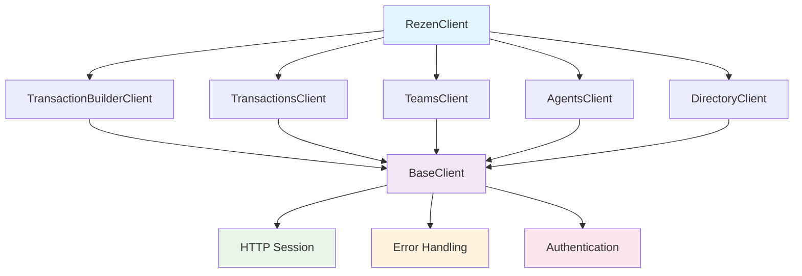

# ReZEN Python Client

[](https://badge.fury.io/py/rezen)
[](https://pypi.org/project/rezen/)
[](https://github.com/theperrygroup/rezen/blob/main/LICENSE)
[](https://codecov.io/gh/theperrygroup/rezen)

The **official Python client** for the ReZEN Real Estate API. Build powerful real estate applications with comprehensive transaction management, agent networking, and team operations.

## 🚀 Quick Start

Get up and running in 60 seconds:

```bash
pip install rezen
```

```python
from typing import Dict, List, Any

from rezen import RezenClient

# Initialize main client
client: RezenClient = RezenClient()

# Search for active teams
teams: List[Dict[str, Any]] = client.teams.search_teams(status="ACTIVE")

# Search for agents in California
agents: List[Dict[str, Any]] = client.agents.search_active_agents(state_or_province=["CALIFORNIA"])

# Create a transaction
response: Dict[str, Any] = client.transaction_builder.create_transaction_builder()
transaction_id: str = response['id']

# Add property details
client.transaction_builder.update_location_info(transaction_id, {
    "address": "123 Main Street",
    "city": "Anytown",
    "state": "CA",
    "zipCode": "90210"
})

# Use Directory API for vendor management through main client
vendors: List[Dict[str, Any]] = client.directory.search_vendors(
    page_number=0,
    page_size=20,
    roles=["TITLE_ESCROW", "LENDER"]
)
```

**[→ Get Started](getting-started/quickstart.md)**{ .md-button .md-button--primary }
**[→ API Reference](api/index.md)**{ .md-button }

---

## ✨ Features

<div class="grid cards" markdown>

-   :material-home: **Transaction Management**

    ---

    Complete transaction lifecycle management from creation to closing, with support for all participant types and financial operations.

    [:octicons-arrow-right-24: Learn more](api/transaction-builder.md)

-   :material-account-group: **Agent & Team Operations**

    ---

    Comprehensive agent search, network hierarchy management, and team operations with advanced filtering capabilities.

    [:octicons-arrow-right-24: Learn more](api/agents.md)

-   :material-cog: **Type-Safe & Robust**

    ---

    Complete type hints, comprehensive error handling, and 100% test coverage for production-ready applications.

    [:octicons-arrow-right-24: Learn more](development/contributing.md)

-   :material-book-open: **Well Documented**

    ---

    Extensive documentation with real-world examples, troubleshooting guides, and comprehensive API reference.

    [:octicons-arrow-right-24: Learn more](guides/examples.md)

</div>

---

## 🎯 Use Cases

### Real Estate Transaction Processing

Build applications that handle the complete real estate transaction lifecycle:

- **Property listings** and transaction creation
- **Participant management** (buyers, sellers, agents, service providers)
- **Financial operations** (commissions, payments, escrow)
- **Document management** and reporting

### Agent Network Management

Manage complex agent networks and hierarchies:

- **Agent discovery** and search capabilities
- **Network analysis** with sponsor trees and downlines
- **Team management** and assignments
- **Performance tracking** and analytics

### Integration & Automation

Integrate ReZEN with your existing systems:

- **CRM integrations** for customer management
- **Accounting systems** for financial tracking
- **Document management** for transaction records
- **Workflow automation** for process optimization

---

## 📊 API Coverage

| **API Section** | **Endpoints** | **Status** |
|-----------------|---------------|------------|
| Transaction Builder | 52 endpoints | ✅ Complete |
| Transactions | 49 endpoints | ✅ Complete |
| Agents | 36 endpoints | ✅ Complete |
| Teams | 2 endpoints | ✅ Complete |
| Directory | 16 endpoints | ✅ Complete |
| **Total** | **155 endpoints** | **✅ Complete** |

---

## 🏗️ Architecture

The ReZEN Python client is built with modern Python best practices:



### Key Design Principles

- **🎯 Simple Interface**: Intuitive method names and clear parameter structures
- **🔒 Type Safety**: Complete type hints for excellent IDE support
- **⚡ Performance**: Efficient HTTP session management and connection pooling
- **🛡️ Reliability**: Comprehensive error handling and retry mechanisms
- **📚 Extensible**: Clean architecture for easy customization and extension

---

## 💡 Examples

### Create a Complete Transaction

```python
from datetime import datetime, timedelta
from typing import Dict, Any

from rezen import RezenClient

client: RezenClient = RezenClient()

# Create transaction builder
response: Dict[str, Any] = client.transaction_builder.create_transaction_builder()
transaction_id: str = response['id']

# Add property details
client.transaction_builder.update_location_info(transaction_id, {
    "address": "1234 Elm Street",
    "city": "San Francisco",
    "state": "CA",
    "zipCode": "94102"
})

# Set pricing and timeline
closing_date: str = (datetime.now() + timedelta(days=45)).strftime("%Y-%m-%d")
client.transaction_builder.update_price_and_date_info(transaction_id, {
    "purchase_price": 850000,
    "closing_date": closing_date
})

# Add participants
client.transaction_builder.add_buyer(transaction_id, {
    "first_name": "Alice",
    "last_name": "Johnson",
    "email": "alice@email.com"
})

# Submit for processing
client.transaction_builder.submit_transaction(transaction_id)
```

### Agent Network Analysis

```python
from typing import Dict, List, Any

from rezen import RezenClient

client: RezenClient = RezenClient()

# Find agents in California
agents: List[Dict[str, Any]] = client.agents.search_active_agents(
    state_or_province=["CALIFORNIA"],
    page_size=50
)

# Analyze agent's network
for agent in agents[:5]:
    agent_id: str = agent['id']

    # Get network statistics
    network_stats: List[Dict[str, Any]] = client.agents.get_network_size_by_tier(agent_id)
    front_line: List[Dict[str, Any]] = client.agents.get_front_line_agents_info(agent_id)

    print(f"Agent {agent['first_name']} {agent['last_name']}:")
    print(f"  Network tiers: {len(network_stats)}")
    print(f"  Front line agents: {len(front_line)}")
```

### Directory Management

```python
from typing import Dict, List, Any

from rezen import RezenClient

client: RezenClient = RezenClient()

# Search for vendors
vendors: List[Dict[str, Any]] = client.directory.search_vendors(
    page_number=0,
    page_size=20,
    is_archived=False,
    state_or_province="CALIFORNIA"
)

# Create a new person
person_data: Dict[str, Any] = {
    "firstName": "Jane",
    "lastName": "Smith",
    "emailAddress": "jane@example.com",
    "phoneNumber": "555-0123"
}
person: Dict[str, Any] = client.directory.create_person(person_data)

# Link person to vendor
client.directory.link_person(person['id'], {
    "vendorId": "vendor-123"
})
```

**[→ More Examples](guides/examples.md)**

---

## 🚦 Getting Started

### 1. Installation

Choose your installation method:

=== "pip"

    ```bash
    pip install rezen
    ```

=== "poetry"

    ```bash
    poetry add rezen
    ```

=== "conda"

    ```bash
    conda install -c conda-forge rezen
    ```

### 2. Authentication

Set up your API credentials:

=== "Environment Variable"

    ```bash
    export REZEN_API_KEY="your_api_key_here"
    ```

=== ".env File"

    ```bash
    # .env
    REZEN_API_KEY=your_api_key_here
    ```

=== "Direct"

    ```python
    client = RezenClient(api_key="your_api_key_here")
    ```

### 3. First API Call

```python
from typing import List, Dict, Any

from rezen import RezenClient

client: RezenClient = RezenClient()
teams: List[Dict[str, Any]] = client.teams.search_teams(status="ACTIVE", page_size=10)
print(f"Found {len(teams)} active teams")
```

**[→ Complete Installation Guide](getting-started/installation.md)**

---

## 📖 Documentation

<div class="grid cards" markdown>

-   **[🚀 Quick Start](getting-started/quickstart.md)**

    5-minute guide to get up and running

-   **[📚 API Reference](api/index.md)**

    Complete API documentation with examples

-   **[💡 Examples](guides/examples.md)**

    Real-world usage patterns and best practices

-   **[🔧 Troubleshooting](guides/troubleshooting.md)**

    Common issues and debugging techniques

-   **[🤝 Contributing](development/contributing.md)**

    Help improve the ReZEN Python client

-   **[📋 Changelog](reference/changelog.md)**

    Version history and release notes

</div>

---

## 🆘 Support

### Community & Help

- **📖 Documentation**: Comprehensive guides and API reference
- **💬 GitHub Issues**: Bug reports and feature requests
- **📧 Email Support**: [support@rezen.com](mailto:support@rezen.com)
- **🌐 Website**: [rezen.com](https://rezen.com)

### Status & Monitoring

- **🔍 API Status**: [status.rezen.com](https://status.rezen.com)
- **📊 PyPI Package**: [pypi.org/project/rezen](https://pypi.org/project/rezen/)
- **🐙 GitHub Repo**: [github.com/your-org/rezen-python-client](https://github.com/your-org/rezen-python-client)

---

## 📄 License

The ReZEN Python client is released under the [MIT License](https://github.com/theperrygroup/rezen/blob/main/LICENSE).

---

**Ready to build powerful real estate applications?** **[Get Started →](getting-started/quickstart.md)**
