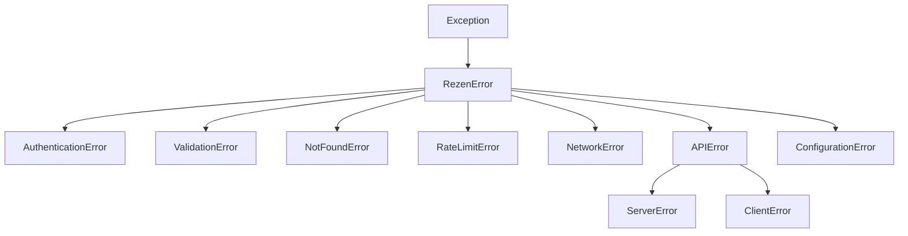

# Exception Reference

Comprehensive error handling guide for the ReZEN Python API client, including exception types, handling patterns, and troubleshooting.

---

## Overview

!!! abstract "Error Handling Philosophy"

    The ReZEN client uses a hierarchical exception system that provides:

    - **Specific Error Types**: Different exceptions for different error conditions
    - **Rich Context**: Detailed error messages with request/response information
    - **Graceful Degradation**: Predictable error handling for robust applications
    - **Debug Information**: Full context for troubleshooting and logging

---

## Exception Hierarchy



---

## Core Exception Types

### Base Exception

=== "⚠️ RezenError"

    **Base exception for all ReZEN API errors**

    ```python
    from typing import List, Dict, Any

    from rezen import RezenClient
    from rezen.exceptions import RezenError

    client: RezenClient = RezenClient()

    try:
        # Any ReZEN API operation
        result: List[Dict[str, Any]] = client.teams.search_teams()
    except RezenError as e:
        print(f"ReZEN API error: {e}")
        print(f"Error details: {e.details}")
    ```

    **Attributes:**
    - `message`: Human-readable error message
    - `status_code`: HTTP status code (if applicable)
    - `details`: Additional error context
    - `response`: Raw HTTP response (if available)

### Authentication Errors

=== "🔐 AuthenticationError"

    **API key or authentication issues**

    ```python
    from typing import List, Dict, Any

    from rezen import RezenClient
    from rezen.exceptions import AuthenticationError

    try:
        client: RezenClient = RezenClient(api_key="invalid_key")
        teams: List[Dict[str, Any]] = client.teams.search_teams()
    except AuthenticationError as e:
        print("Authentication failed - check your API key")
        # Handle authentication error
        # - Prompt for new API key
        # - Refresh authentication token
        # - Log security event
    ```

    **Common Causes:**
    - Invalid API key
    - Expired authentication token
    - Missing API key
    - Insufficient permissions

    !!! warning "Security Considerations"

        Never log API keys in error messages. Always sanitize authentication errors before logging.

### Validation Errors

=== "🚨 ValidationError"

    **Invalid input data or parameters**

    ```python
    from typing import Dict, Any

    from rezen import RezenClient
    from rezen.exceptions import ValidationError

    client: RezenClient = RezenClient()

    try:
        # Invalid email format
        response: Dict[str, Any] = client.agents.get_agents_by_email("invalid-email")
    except ValidationError as e:
        print(f"Validation error: {e.message}")
        print(f"Invalid fields: {e.invalid_fields}")
        # Handle validation error
        # - Show user-friendly error message
        # - Highlight invalid form fields
        # - Provide correction suggestions
    ```

    **Extended Attributes:**
    - `invalid_fields`: List of fields that failed validation
    - `validation_details`: Detailed validation error information

### Resource Errors

=== "❓📄 NotFoundError"

    **Requested resource does not exist**

    ```python
    from typing import Dict, Any

    from rezen import RezenClient
    from rezen.exceptions import NotFoundError

    client: RezenClient = RezenClient()

    try:
        transaction: Dict[str, Any] = client.transactions.get_transaction("invalid-id")
    except NotFoundError as e:
        print(f"Resource not found: {e.resource_type}")
        print(f"Resource ID: {e.resource_id}")
        # Handle not found error
        # - Show "not found" message to user
        # - Redirect to search page
        # - Log potential data inconsistency
    ```

    **Extended Attributes:**
    - `resource_type`: Type of resource that wasn't found
    - `resource_id`: ID of the requested resource

### Rate Limiting

=== "⏱️ RateLimitError"

    **API rate limit exceeded**

    ```python
    import time
    from typing import List, Dict, Any

    from rezen import RezenClient
    from rezen.exceptions import RateLimitError

    client: RezenClient = RezenClient()

    def api_call_with_retry() -> List[Dict[str, Any]]:
        """Make API call with rate limit retry logic.

        Returns:
            List of teams from API

        Raises:
            RateLimitError: If max retries exceeded
        """
        max_retries: int = 3
        for attempt in range(max_retries):
            try:
                return client.teams.search_teams()
            except RateLimitError as e:
                if attempt == max_retries - 1:
                    raise  # Re-raise if max retries exceeded

                # Wait before retrying
                wait_time: int = e.retry_after or 60
                print(f"Rate limited. Waiting {wait_time} seconds...")
                time.sleep(wait_time)
    ```

    **Extended Attributes:**
    - `retry_after`: Seconds to wait before retrying
    - `limit_type`: Type of rate limit (per minute, per hour, etc.)
    - `current_usage`: Current API usage count

### Network Errors

=== "📡 NetworkError"

    **Connection and network-related issues**

    ```python
    import logging
    from typing import Dict, Any, List

    from rezen import RezenClient
    from rezen.exceptions import NetworkError

    client: RezenClient = RezenClient()

    def robust_api_call() -> Dict[str, Any]:
        """Make robust API call with network error handling.

        Returns:
            API response or error dictionary
        """
        try:
            return client.agents.search_active_agents()
        except NetworkError as e:
            logging.error(f"Network error: {e}")

            # Handle different network scenarios
            if "timeout" in str(e).lower():
                # Handle timeout
                return {"error": "Request timed out. Please try again."}
            elif "connection" in str(e).lower():
                # Handle connection error
                return {"error": "Unable to connect. Check your internet connection."}
            else:
                # Handle other network errors
                return {"error": "Network error occurred. Please try again later."}
    ```

### Server Errors

=== "🖥️ ServerError"

    **API server-side errors (5xx status codes)**

    ```python
    import logging
    from typing import Dict, Any, Callable, Optional

    from rezen import RezenClient
    from rezen.exceptions import ServerError

    client: RezenClient = RezenClient()

    def handle_server_error() -> Optional[Dict[str, Any]]:
        """Handle server errors with retry logic.

        Returns:
            API response if successful, None if failed
        """
        try:
            return client.transactions.get_transaction("tx-123")
        except ServerError as e:
            # Log server error for monitoring
            logging.error(f"Server error {e.status_code}: {e.message}")

            # Implement retry logic for server errors
            if e.status_code >= 500:
                # Exponential backoff retry
                return retry_with_backoff(api_call)
            else:
                # Client error, don't retry
                raise

        return None
    ```

---

## Auto-Generated Exception Documentation

### Exception Classes Module

::: rezen.exceptions
    options:
      show_source: false
      show_root_heading: true
      heading_level: 3

---

## Error Handling Patterns

### Comprehensive Error Handler

=== "🛡️ Production Ready"

    ```python
    import logging
    import time
    from typing import Optional, Dict, Any, Callable, List

    from rezen import RezenClient
    from rezen.exceptions import (
        RezenError, AuthenticationError, ValidationError,
        NotFoundError, RateLimitError, NetworkError, ServerError
    )

    class RezenAPIHandler:
        """Production-ready ReZEN API handler with comprehensive error handling."""

        def __init__(self, api_key: Optional[str] = None) -> None:
            """Initialize the API handler.

            Args:
                api_key: Optional API key for authentication
            """
            self.client: RezenClient = RezenClient(api_key=api_key)
            self.logger: logging.Logger = logging.getLogger(__name__)

        def safe_api_call(self, operation: Callable[..., Any], *args: Any, **kwargs: Any) -> Dict[str, Any]:
            """Execute API call with comprehensive error handling.

            Args:
                operation: Callable API operation to execute
                *args: Positional arguments for the operation
                **kwargs: Keyword arguments for the operation

            Returns:
                Dictionary containing success status and data or error information
            """
            max_retries: int = 3
            base_delay: int = 1

            for attempt in range(max_retries):
                try:
                    result: Any = operation(*args, **kwargs)
                    return {"success": True, "data": result}

                except AuthenticationError as e:
                    self.logger.error("Authentication failed", exc_info=True)
                    return {
                        "success": False,
                        "error_type": "authentication",
                        "message": "Invalid credentials. Please check your API key.",
                        "retry": False
                    }

                except ValidationError as e:
                    self.logger.warning(f"Validation error: {e.invalid_fields}")
                    return {
                        "success": False,
                        "error_type": "validation",
                        "message": str(e),
                        "invalid_fields": e.invalid_fields,
                        "retry": False
                    }

                except NotFoundError as e:
                    return {
                        "success": False,
                        "error_type": "not_found",
                        "message": f"{e.resource_type} not found",
                        "retry": False
                    }

                except RateLimitError as e:
                    if attempt < max_retries - 1:
                        wait_time: int = e.retry_after or (base_delay * (2 ** attempt))
                        self.logger.info(f"Rate limited. Waiting {wait_time}s...")
                        time.sleep(wait_time)
                        continue

                    return {
                        "success": False,
                        "error_type": "rate_limit",
                        "message": "Rate limit exceeded. Please try again later.",
                        "retry_after": e.retry_after
                    }

                except (NetworkError, ServerError) as e:
                    if attempt < max_retries - 1:
                        delay: int = base_delay * (2 ** attempt)
                        self.logger.warning(f"Network/Server error. Retrying in {delay}s...")
                        time.sleep(delay)
                        continue

                    return {
                        "success": False,
                        "error_type": "network" if isinstance(e, NetworkError) else "server",
                        "message": "Service temporarily unavailable. Please try again later.",
                        "retry": True
                    }

                except RezenError as e:
                    self.logger.error(f"Unexpected ReZEN error: {e}", exc_info=True)
                    return {
                        "success": False,
                        "error_type": "api_error",
                        "message": "An unexpected error occurred. Please contact support.",
                        "retry": False
                    }

                except Exception as e:
                    self.logger.error(f"Unexpected error: {e}", exc_info=True)
                    return {
                        "success": False,
                        "error_type": "unknown",
                        "message": "An unexpected error occurred.",
                        "retry": False
                    }

            return {
                "success": False,
                "error_type": "max_retries",
                "message": "Maximum retry attempts exceeded.",
                "retry": False
            }
    ```

=== "📝 Usage Example"

    ```python
    from typing import List, Dict, Any

    # Usage of the comprehensive error handler
    handler: RezenAPIHandler = RezenAPIHandler()

    # Safe team search
    result: Dict[str, Any] = handler.safe_api_call(
        handler.client.teams.search_teams,
        status="ACTIVE",
        page_size=10
    )

    if result["success"]:
        teams: List[Dict[str, Any]] = result["data"]
        print(f"Found {len(teams)} teams")
    else:
        print(f"Error: {result['message']}")
        if result.get("retry"):
            print("This error may be temporary. Consider retrying.")
    ```

### Context Managers for Error Handling

=== "📋 Context Manager"

    ```python
    import logging
    from contextlib import contextmanager
    from typing import Generator

    from rezen.exceptions import RezenError

    @contextmanager
    def rezen_error_context(operation_name: str) -> Generator[None, None, None]:
        """Context manager for ReZEN API operations with logging.

        Args:
            operation_name: Name of the operation for logging

        Yields:
            None

        Raises:
            RezenError: If API operation fails
            Exception: For unexpected errors
        """
        logger: logging.Logger = logging.getLogger(__name__)
        logger.info(f"Starting {operation_name}")

        try:
            yield
            logger.info(f"Completed {operation_name}")
        except RezenError as e:
            logger.error(f"Failed {operation_name}: {e}")
            raise
        except Exception as e:
            logger.error(f"Unexpected error in {operation_name}: {e}")
            raise

    # Usage
    from typing import List, Dict, Any

    from rezen import RezenClient

    client: RezenClient = RezenClient()

    with rezen_error_context("team search"):
        teams: List[Dict[str, Any]] = client.teams.search_teams(status="ACTIVE")
    ```

---

## Debugging and Troubleshooting

### Logging Configuration

!!! tip "Production Logging Setup"

    ```python
    import logging

    from rezen import RezenClient

    # Configure logging for ReZEN operations
    logging.basicConfig(
        level=logging.INFO,
        format='%(asctime)s - %(name)s - %(levelname)s - %(message)s',
        handlers=[
            logging.FileHandler('rezen_api.log'),
            logging.StreamHandler()
        ]
    )

    # Set ReZEN client to debug mode
    client: RezenClient = RezenClient(debug=True)
    ```

### Error Analysis Tools

=== "🐛 Debug Information"

    ```python
    from rezen.exceptions import RezenError

    def analyze_error(error: RezenError) -> None:
        """Analyze ReZEN error for debugging.

        Args:
            error: ReZEN error to analyze
        """
        print("=== Error Analysis ===")
        print(f"Error Type: {type(error).__name__}")
        print(f"Message: {error.message}")
        print(f"Status Code: {getattr(error, 'status_code', 'N/A')}")

        if hasattr(error, 'response') and error.response:
            print(f"Request URL: {error.response.request.url}")
            print(f"Request Method: {error.response.request.method}")
            print(f"Response Headers: {dict(error.response.headers)}")

        if hasattr(error, 'details') and error.details:
            print(f"Error Details: {error.details}")

    # Usage
    from typing import List, Dict, Any

    from rezen import RezenClient

    client: RezenClient = RezenClient()

    try:
        teams: List[Dict[str, Any]] = client.teams.search_teams()
    except RezenError as e:
        analyze_error(e)
    ```

=== "📈 Error Monitoring"

    ```python
    import time
    from collections import defaultdict
    from typing import Dict, List, Any, DefaultDict

    from rezen.exceptions import RezenError

    class ErrorMonitor:
        """Monitor and track API errors for analysis."""

        def __init__(self) -> None:
            """Initialize the error monitor."""
            self.error_counts: DefaultDict[str, int] = defaultdict(int)
            self.error_history: List[Dict[str, Any]] = []

        def record_error(self, error: RezenError) -> None:
            """Record error occurrence.

            Args:
                error: ReZEN error to record
            """
            error_type: str = type(error).__name__
            self.error_counts[error_type] += 1
            self.error_history.append({
                "timestamp": time.time(),
                "error_type": error_type,
                "message": str(error),
                "status_code": getattr(error, 'status_code', None)
            })

        def get_error_summary(self) -> Dict[str, Any]:
            """Get summary of recorded errors.

            Returns:
                Dictionary containing error summary information
            """
            return {
                "total_errors": len(self.error_history),
                "error_counts": dict(self.error_counts),
                "recent_errors": self.error_history[-10:]  # Last 10 errors
            }

    # Usage
    from rezen import RezenClient

    monitor: ErrorMonitor = ErrorMonitor()
    client: RezenClient = RezenClient()

    try:
        teams: List[Dict[str, Any]] = client.teams.search_teams()
    except RezenError as e:
        monitor.record_error(e)
        summary: Dict[str, Any] = monitor.get_error_summary()
        print(summary)
    ```

---

## Best Practices

### 🛡️ Error Prevention

!!! tip "Proactive Error Prevention"

    - **Validate Input**: Check data before making API calls
    - **Handle Rate Limits**: Implement proper rate limiting in your application
    - **Use Timeouts**: Set appropriate timeouts for API calls
    - **Monitor Errors**: Track error patterns for proactive fixes

### 🔄 Retry Strategies

!!! example "Exponential Backoff Implementation"

    ```python
    import random
    import time
    from rezen.exceptions import RateLimitError, NetworkError, ServerError

    def exponential_backoff_retry(func, max_retries=3, base_delay=1):
        """Retry function with exponential backoff and jitter."""

        for attempt in range(max_retries):
            try:
                return func()
            except (RateLimitError, NetworkError, ServerError) as e:
                if attempt == max_retries - 1:
                    raise  # Last attempt, re-raise the error

                # Calculate delay with exponential backoff and jitter
                delay = base_delay * (2 ** attempt)
                jitter = random.uniform(0, delay * 0.1)  # 10% jitter
                total_delay = delay + jitter

                print(f"Attempt {attempt + 1} failed. Retrying in {total_delay:.2f}s...")
                time.sleep(total_delay)
    ```

### 🔒 Security Considerations

!!! warning "Security Best Practices"

    - **Never log API keys** in error messages or logs
    - **Sanitize error messages** before showing to users
    - **Implement rate limiting** to prevent abuse
    - **Monitor authentication failures** for security threats

---

## Quick Reference

### Exception Type Mapping

| Exception | HTTP Status | When It Occurs | Retry? |
|-----------|-------------|----------------|--------|
| `AuthenticationError` | 401, 403 | Invalid API key, insufficient permissions | No |
| `ValidationError` | 400 | Invalid input parameters | No |
| `NotFoundError` | 404 | Resource doesn't exist | No |
| `RateLimitError` | 429 | Rate limit exceeded | Yes (with delay) |
| `NetworkError` | - | Connection issues, timeouts | Yes |
| `ServerError` | 500-599 | Server-side errors | Yes |
| `ClientError` | 400-499 | Client-side errors (except above) | No |

### Common Error Codes

| Status Code | Exception | Description |
|-------------|-----------|-------------|
| 400 | `ValidationError` | Bad request, invalid parameters |
| 401 | `AuthenticationError` | Unauthorized, invalid API key |
| 403 | `AuthenticationError` | Forbidden, insufficient permissions |
| 404 | `NotFoundError` | Resource not found |
| 429 | `RateLimitError` | Too many requests |
| 500 | `ServerError` | Internal server error |
| 502 | `ServerError` | Bad gateway |
| 503 | `ServerError` | Service unavailable |

---

## Next Steps

<div class="grid cards" markdown>

-   [🔧 **Transaction Builder**](../api/transaction-builder.md)

    Learn about transaction creation with proper error handling

-   [📝 **Data Types**](data-types.md)

    Understand data validation and type safety

-   [📄 **Examples**](../guides/examples.md)

    See error handling in practical examples

-   [📖 **API Reference**](../api/index.md)

    Return to the main API reference

</div>
